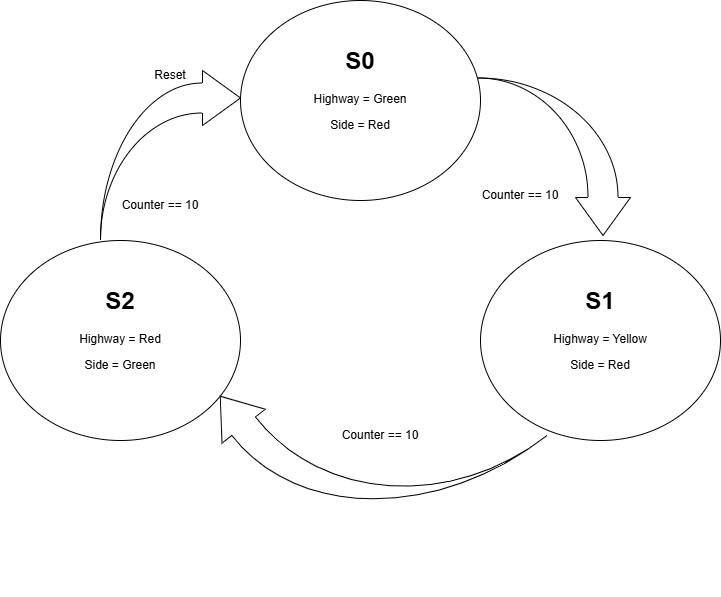
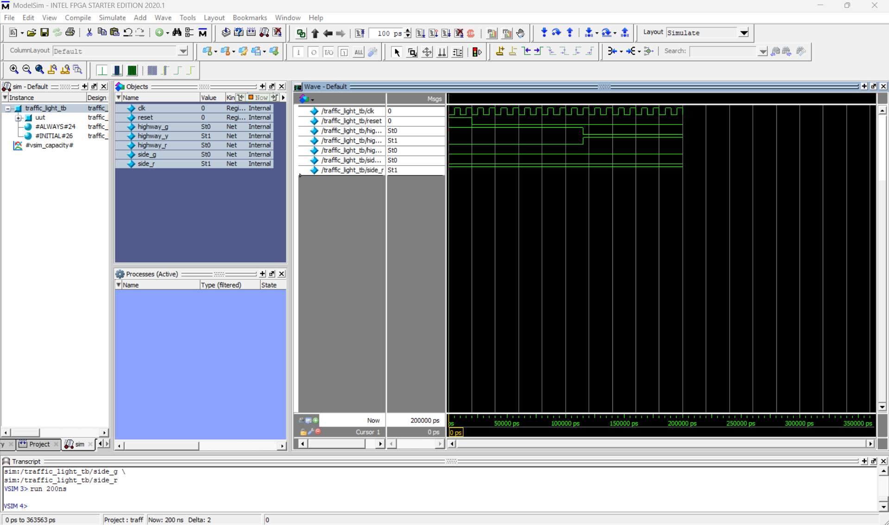

# Traffic Light Controller using FSM (Verilog)

This project implements a **Finite State Machine (FSM)** based traffic light controller using Verilog HDL and simulated in ModelSim.

## 🚦 System Description

The controller manages traffic lights for a highway and a side road using three states.

| State | Highway | Side Road |
|------|------|------|
| S0 | Green | Red |
| S1 | Yellow | Red |
| S2 | Red | Green |

The FSM cycles through these states with a timer counter controlling the duration.

---

## 🧠 Design Concepts Used

- Finite State Machine (Moore Machine)
- Sequential Logic
- State Encoding
- Counter based timing
- Verilog RTL Design
- Testbench Simulation

---

## 📊 FSM State Diagram

---

## 🖥 Simulation Waveform

---

## 📂 Project Structure

